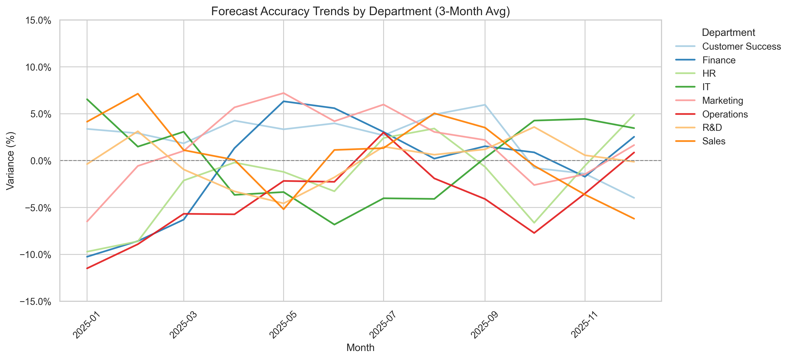

# Revenue Forecasting Model

Accurately tracking department-level revenue forecasts using real-world FP&A principles and synthetic monthly data.

---

## Who Is This For?

- Financial analysts monitoring forecast vs. actual performance
- Stakeholders reviewing forecast accuracy by department
- Data professionals building executive-facing analytics
- Python learners applying Pandas and Seaborn to FP&A problems

---

## Project Structure

| Plot | Filename                                  | Description                                      |
|------|-------------------------------------------|--------------------------------------------------|
| **1** | `plot1_forecast_vs_actual_by_dept.png`     | Total Forecast vs Actual by Department (bar)     |
| **2** | `plot2_avg_forecast_deviation_by_dept.png` | Avg Forecast Deviation % by Department (bar)     |
| **3** | `plot3_monthly_forecast_vs_actaul.png`     | Forecast vs Actual by Month (facet grid)         |
| **4** | `plot4_smoothed_forecast_accuracy_by_dept.png` | Smoothed Forecast Accuracy (12-month trend) |
| **Text** | `executive_summary.txt`                    | Executive KPI summary (auto-generated)           |

---

## Sample Visuals

| Plot 1 | Plot 2 |
|--------|--------|
|  |  |

| Plot 3 | Plot 4 |
|--------|--------|
|  |  |

---

## Output Files

- `plot1_forecast_vs_actual_by_dept.png`
- `plot2_avg_forecast_deviation_by_dept.png`
- `plot3_monthly_forecast_vs_actual.png`
- `plot4_smoothed_forecast_accuracy_by_dept.png`
- `executive_summary.txt`

---

## Tools & Libraries

- Python 3
- pandas
- numpy
- matplotlib
- seaborn

---
> _Synthetic data used for learning purposes only._

---

## How to Run

### 1. Clone this Repo
```bash
git clone https://github.com/ameer-nassar/revenue-forecast-model.git
cd revenue-forecast-model
```

### 2. Install Requirements
```bash
pip install -r minimum_requirements.txt
```

### 3. Run the Script
```bash
python revenue_forecast_model.py
```

---

## Summary Output Example

```
========== Revenue Forecast Executive Summary ==========
Total Forecast : $31,051,682
Total Actual   : $31,116,956
Total Variance : $65,274 USD (+0.21%)

Customer Success     1.7% over forecast  (+$67,235 USD)
Finance              0.7% over forecast  (+$25,759 USD)
HR                   0.4% under forecast (−$13,708 USD)
IT                   0.2% under forecast (−$5,849 USD)
Marketing            2.7% over forecast  (+$100,179 USD)
Operations           2.5% under forecast (−$101,873 USD)
R&D                  0.3% under forecast (−$12,371 USD)
Sales                0.2% over forecast  (+$5,902 USD)
```
